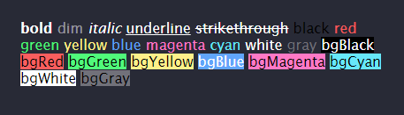

<div align='center'>
<h1>Chalk-dom</h1>
<p>chalk for the browser</p>

</div>
<br/>

> Just like [chalk](https://github.com/chalk/chalk) but right in your browser. It uses HTMElement elements (b,s,i,span) and a little inline-css.

<br/>

## Features

- Expressive API
- Highly performant
- Ability to nest styles
- Customizable
- Doesn't extend `String.prototype`
- Clean and focused
- Actively maintained

## Install

```console
$ npm install chalk-dom
```

## Usage

### HTML

```html
<div id='console'></div>
```

### JavaScript

```js
import chalk from 'chalk-dom';

const consoleBox = document.getElementById('console');

function log(...data) {
    consoleBox.innerHTML += `<div>${data.join(' ')}</div>`;
}

log(chalk.blue('Hello World!'));
```

## Demo

To run the [demo](https://github.com/henryhale/chalko/blob/master/demo), clone this repo and simply open the [index.html](https://github.com/henryhale/chalko/blob/master/demo/index.html) file in your browser.

## API

The one difference with [inken](https://github.com/henryhale/inken) is styles can be chained with [chalko](https://github.com/henryhale/chalko).

```js
import chalk from 'chalk-dom';

...

log(chalk.bgBlack.yellow.italic('Hello, World!'));
```

## Styles

### Modifiers

- `bold` - Make the text bold.
- `dim` - Make the text have lower opacity (sets css opacity to `0.5`).
- `italic` - Make the text italic.
- `underline` - Underline the text.
- `strikethrough` - Put a horizontal line through the center of the text.

### User defined

- `fg` - Set a custom foreground color (text color)
- `bg` - Set a custom background color

### Colors

- `black`
- `red`
- `green`
- `yellow`
- `blue`
- `magenta`
- `cyan`
- `white`
- `gray`

### Background colors

- `bgBlack`
- `bgRed`
- `bgGreen`
- `bgYellow`
- `bgBlue`
- `bgMagenta`
- `bgCyan`
- `bgWhite`
- `bgGray`

## Related

- [Inken](https://github.com/henryhale/inken) - terminal-like string styling for the browser

## LICENSE

Released under the [MIT License](https://github.com/henryhale/chalko/blob/master/LICENSE)
